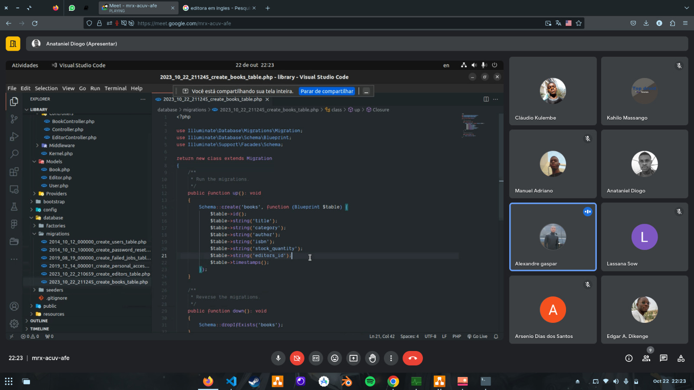
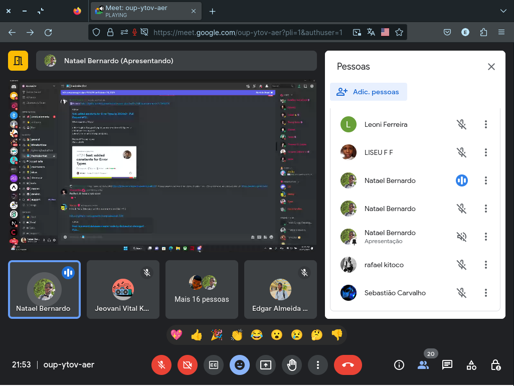

# LCCT2T

## Fisrt Contributors

 - Kahilo Massango
 - Alexandre Gaspar
 - Rafael Kitoco
 - Anataniel Diogo
 - Alassana Sow
 - Edgar Dikenge
 - Cláudio Kulembe
 - Ananias Tomas 

 ### Projects

    - Library 001

## Todo Task

  > 001- Modelagem Final & Sql
  > 001 - API
  > 001 - Mobile App (kotlin)

## Mettings

001 - Sqlite by *Rafael*

002 - API with Laravel(php) by *Anataniel Diogo*
  

003 - Freelancer by *Natael Bernardo*

## links

  > https://render.com/

  > https://www.atlassian.com/git/tutorials/comparing-workflows/gitflow-workflow

  > https://www.talent.io/
  
  > https://www.reddit.com/r/ExperiencedDevs/
  
  > https://dev.to/
 
  > https://www.producthunt.com/

  > link para a ANGOLA OPEN-SOURCE COMMUNITY (https://discord.com/invite/tuUDNdRzvz)
  
  Dev's AO (https://discord.gg/6MH2y5wa7u) discord
  
  https://www.upwork.com/
  
  https://www.workana.com/
  
  https://www.freelancer.com/
  
  CDA : https://chat.whatsapp.com/IX7Lw2EYysD0iH76DbIvXl

  https://training.linuxfoundation.org/full-catalog/

  https://www.educative.io/

 https://roadmap.sh/

 https://education.github.com/

 https://training.linuxfoundation.org/full-catalog/

 https://www.linkedin.com/company/8t080businessclub/

ideias de projecto(https://ruas-angola.openalfa.com/) 

